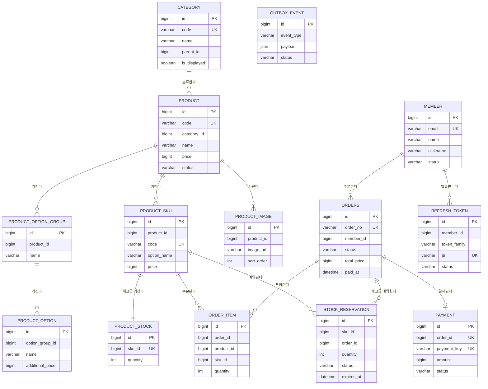

# 데이터베이스 설계

## 물리 FK를 사용하지 않는 이유

이 프로젝트는 테이블 간 관계를 컬럼과 인덱스로만 표현하고, **물리적인 FOREIGN KEY 제약은 두지 않습니다.** 아래 ERD의 관계선도 실제 DB 제약이 아니라 논리적인 참조 관계를 나타낸 것입니다.

1. **분산 DB 전환 대비** — 서비스가 커지면 도메인별로 DB 서버를 분리(샤딩·분산)할 가능성이 있는데, 이때 서로 다른 DB 서버에 걸쳐 있는 테이블끼리는 물리 FK로 연결할 수 없습니다. 처음부터 FK 없이 설계해두면, 나중에 테이블을 다른 서버로 옮기더라도 스키마 구조를 바꿀 필요가 없습니다.
2. **테스트 작성 편의성** — 물리 FK가 있으면 테스트에서 특정 테이블에 데이터를 넣을 때마다 연관된 상위 테이블에도 매번 데이터를 미리 넣어줘야 합니다. FK 제약을 두지 않으면 테스트 대상 테이블만 독립적으로 준비할 수 있어 테스트 코드가 훨씬 가벼워집니다.

대신 애플리케이션 레벨에서 참조 무결성을 관리하고, 참조가 잦은 컬럼에는 인덱스를 걸어 조회 성능을 확보합니다.

## ERD

## 테이블 명세

### category — 카테고리

| 컬럼 | 타입 | NULL | 설명 |
|---|---|---|---|
| id | BIGINT | NOT NULL | PK |
| code | VARCHAR(30) | NOT NULL | UNIQUE, 카테고리 코드 |
| name | VARCHAR(50) | NOT NULL | 카테고리 이름 |
| parent_id | BIGINT | NULL | 부모 카테고리 ID (NULL = 최상위) |
| is_displayed | BOOLEAN | NOT NULL | 노출 여부, 기본 TRUE |

인덱스: `uk_category_code(code)`, `uk_category_parent_name(parent_id, name)`, `idx_category_parent_id(parent_id)`

### member — 회원

| 컬럼 | 타입 | NULL | 설명 |
|---|---|---|---|
| id | BIGINT | NOT NULL | PK |
| email | VARCHAR(100) | NOT NULL | UNIQUE |
| password | VARCHAR(255) | NOT NULL | |
| name | VARCHAR(50) | NOT NULL | |
| nickname | VARCHAR(50) | NOT NULL | |
| status | VARCHAR(20) | NOT NULL | 회원 상태 |
| phone_number | VARCHAR(255) | NULL | 암호화 대비 확장 |
| last_logined_at | DATETIME(6) | NULL | |
| is_deleted | BOOLEAN | NOT NULL | 기본 FALSE |

인덱스: `uk_member_email(email)`

### product — 상품

| 컬럼 | 타입 | NULL | 설명 |
|---|---|---|---|
| id | BIGINT | NOT NULL | PK |
| code | VARCHAR(30) | NOT NULL | UNIQUE |
| category_id | BIGINT | NOT NULL | 논리 참조 |
| name | VARCHAR(100) | NOT NULL | |
| description | VARCHAR(1000) | NULL | |
| price | BIGINT | NOT NULL | 원 단위 |
| status | VARCHAR(20) | NOT NULL | |
| is_deleted | BOOLEAN | NOT NULL | 기본 FALSE |

인덱스: `idx_product_category_active(category_id, is_deleted, created_at, id)`, `idx_product_active_created(is_deleted, created_at, id)`, `idx_product_category_price(category_id, is_deleted, price, id)`, `idx_product_active_price(is_deleted, price, id)`

> `stock_quantity` 컬럼은 초기 버전에 있었다가, 이후 SKU 단위 재고 구조로 이전되며 제거됐습니다.

### product_option_group — 상품 옵션 그룹

| 컬럼 | 타입 | NULL | 설명 |
|---|---|---|---|
| id | BIGINT | NOT NULL | PK |
| product_id | BIGINT | NOT NULL | 논리 참조 |
| name | VARCHAR(50) | NOT NULL | 예: 색상, 사이즈 |
| display_order | INT | NOT NULL | 기본 0 |

인덱스: `idx_option_group_product_id(product_id)`

### product_option — 상품 옵션 값

| 컬럼 | 타입 | NULL | 설명 |
|---|---|---|---|
| id | BIGINT | NOT NULL | PK |
| option_group_id | BIGINT | NOT NULL | 논리 참조 |
| name | VARCHAR(50) | NOT NULL | 예: 블랙, M |
| additional_price | BIGINT | NOT NULL | 기본 0 |
| display_order | INT | NOT NULL | 기본 0 |

인덱스: `idx_option_option_group_id(option_group_id)`

### product_sku — 상품 SKU

| 컬럼 | 타입 | NULL | 설명 |
|---|---|---|---|
| id | BIGINT | NOT NULL | PK |
| product_id | BIGINT | NOT NULL | 논리 참조 |
| code | VARCHAR(30) | NOT NULL | UNIQUE, 서버 생성 |
| option_name | VARCHAR(255) | NOT NULL | 옵션 조합 스냅샷 |
| price | BIGINT | NOT NULL | 기본가 + 옵션 추가금 |

인덱스: `uk_product_sku_code(code)`, `idx_product_sku_product_id(product_id)`

### product_stock — 상품 재고 (SKU 단위)

| 컬럼 | 타입 | NULL | 설명 |
|---|---|---|---|
| id | BIGINT | NOT NULL | PK |
| sku_id | BIGINT | NOT NULL | UNIQUE, 논리 참조 |
| quantity | INT | NOT NULL | 재고 수량 |

인덱스: `uk_product_stock_sku_id(sku_id)`

### product_image — 상품 이미지

| 컬럼 | 타입 | NULL | 설명 |
|---|---|---|---|
| id | BIGINT | NOT NULL | PK |
| product_id | BIGINT | NOT NULL | 논리 참조 |
| image_url | VARCHAR(500) | NOT NULL | 스토리지 공개 경로 |
| sort_order | INT | NOT NULL | 기본 0, 최솟값이 대표 이미지 |

인덱스: `idx_product_image_product_id(product_id)`

### orders — 주문

| 컬럼 | 타입 | NULL | 설명 |
|---|---|---|---|
| id | BIGINT | NOT NULL | PK |
| order_no | VARCHAR(30) | NOT NULL | UNIQUE |
| member_id | BIGINT | NOT NULL | 논리 참조 |
| status | VARCHAR(20) | NOT NULL | |
| total_price | BIGINT | NOT NULL | 원 단위 |
| order_name | VARCHAR(255) | NULL | 대표상품명 외 N건 |
| paid_at | DATETIME(6) | NULL | 결제 완료 시각 (자동 구매확정 기준) |

인덱스: `uk_orders_order_no(order_no)`, `idx_orders_member_id(member_id)`, `idx_orders_member_created_id(member_id, created_at, id)`

### order_item — 주문 아이템

| 컬럼 | 타입 | NULL | 설명 |
|---|---|---|---|
| id | BIGINT | NOT NULL | PK |
| order_id | BIGINT | NOT NULL | 논리 참조 |
| product_id | BIGINT | NOT NULL | 논리 참조 |
| sku_id | BIGINT | NOT NULL | 논리 참조 |
| product_name | VARCHAR(100) | NOT NULL | 주문 시점 스냅샷 |
| option_name | VARCHAR(255) | NOT NULL | 주문 시점 스냅샷 |
| price | BIGINT | NOT NULL | 주문 시점 스냅샷 |
| quantity | INT | NOT NULL | |

인덱스: `idx_order_item_order_id(order_id)`

### payment — 결제

| 컬럼 | 타입 | NULL | 설명 |
|---|---|---|---|
| id | BIGINT | NOT NULL | PK |
| order_id | BIGINT | NOT NULL | UNIQUE, 논리 참조 |
| payment_key | VARCHAR(200) | NOT NULL | UNIQUE, 토스 결제 키 |
| amount | BIGINT | NOT NULL | |
| status | VARCHAR(20) | NOT NULL | |
| method | VARCHAR(30) | NULL | |
| approved_at | DATETIME(6) | NULL | |
| card_number_masked | VARCHAR(30) | NULL | 원본 PAN 저장 금지 |
| virtual_account_secret | VARCHAR(100) | NULL | 웹훅 위조 검증용 |
| raw_response | JSON | NULL | 승인 응답 원본 |
| cancel_reason / canceled_at | VARCHAR(200) / DATETIME(6) | NULL | 취소 사유·일시 |

인덱스: `uk_payment_order_id(order_id)`, `uk_payment_payment_key(payment_key)`

### stock_reservation — 재고 예약

| 컬럼 | 타입 | NULL | 설명 |
|---|---|---|---|
| id | BIGINT | NOT NULL | PK |
| sku_id | BIGINT | NOT NULL | 논리 참조 |
| order_id | BIGINT | NOT NULL | 논리 참조, 주문 단위 일괄 확정/해제 |
| quantity | INT | NOT NULL | |
| status | VARCHAR(20) | NOT NULL | |
| expires_at | DATETIME(6) | NULL | HELD 상태에서만 유효 |

인덱스: `idx_reservation_order_id(order_id)`, `idx_reservation_status_expires(status, expires_at)`

### outbox_event — 트랜잭셔널 아웃박스

| 컬럼 | 타입 | NULL | 설명 |
|---|---|---|---|
| id | BIGINT | NOT NULL | PK |
| event_type | VARCHAR(255) | NOT NULL | 복원용 클래스 FQN |
| payload | JSON | NOT NULL | 직렬화된 이벤트 본문 |
| status | VARCHAR(20) | NOT NULL | 발행 상태 |
| published_at | DATETIME(6) | NULL | |

인덱스: `idx_outbox_event_status(status)`

### refresh_token — 리프레시 토큰 저장소

| 컬럼 | 타입 | NULL | 설명 |
|---|---|---|---|
| id | BIGINT | NOT NULL | PK |
| member_id | BIGINT | NOT NULL | 논리 참조 |
| token_family | VARCHAR(36) | NOT NULL | 회전 전반에서 유지되는 체인 ID |
| jti | VARCHAR(36) | NOT NULL | UNIQUE, 리프레시 JWT의 jti |
| status | VARCHAR(20) | NOT NULL | |
| expires_at | DATETIME(6) | NOT NULL | |

인덱스: `uk_refresh_token_jti(jti)`, `idx_refresh_token_family(token_family)`, `idx_refresh_token_expires_at(expires_at)`
